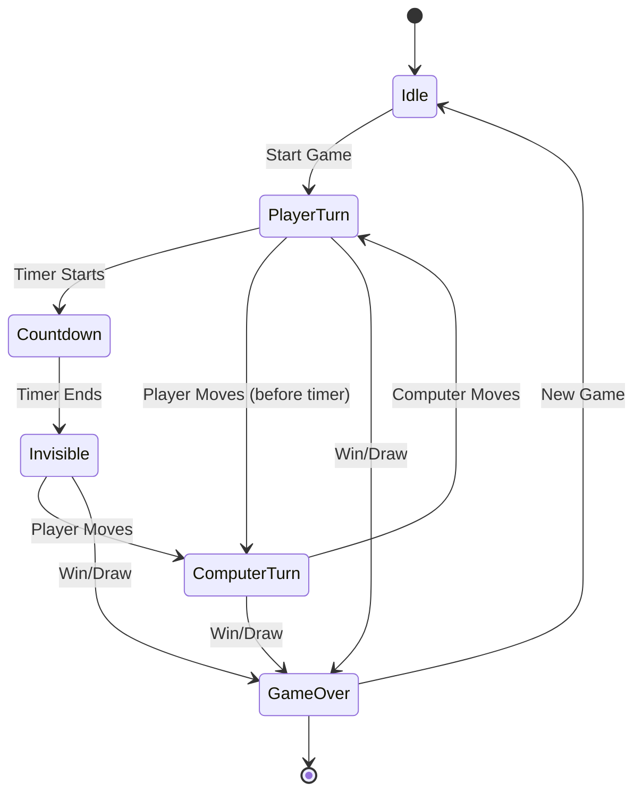

# State Flow - TicTacToe Memory Challenge

## Business State Diagram

## State Definitions
- **Idle**: No active game, waiting for player to start
- **PlayerTurn**: Player's turn, countdown visible and running
- **Countdown**: Timer actively counting down (visual state)
- **Invisible**: Countdown ended, board marks are hidden
- **ComputerTurn**: AI is calculating and making its move
- **GameOver**: Game ended with win, loss, or draw

## Transitions
1. **Idle → PlayerTurn**: Player clicks "New Game"
2. **PlayerTurn → Invisible**: Countdown reaches 0
3. **PlayerTurn/Invisible → ComputerTurn**: Player places mark
4. **ComputerTurn → PlayerTurn**: Computer places mark, game continues
5. **Any → GameOver**: Three in a row or board full
6. **GameOver → Idle**: Player starts new game
